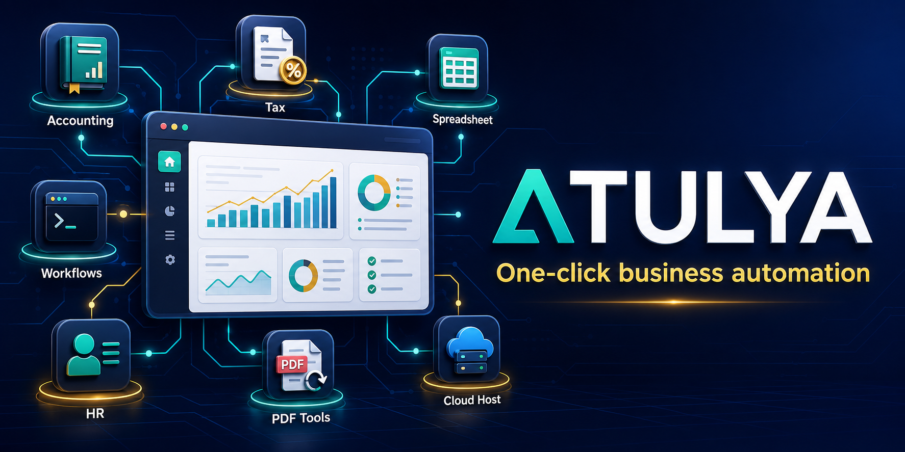
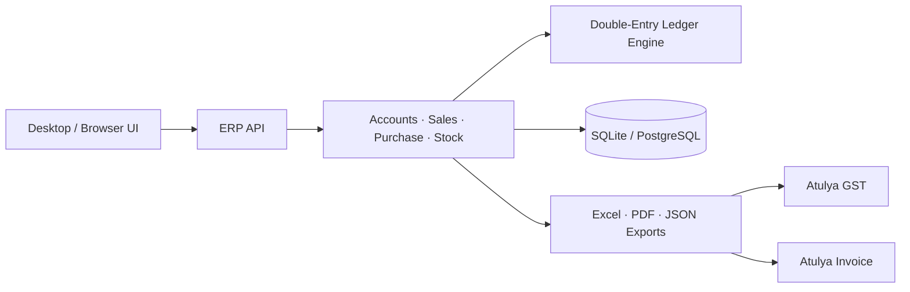

# Atulya ERP

> **A free, local-first business operating system for Indian enterprises and growing shops.** 📒📦

Atulya ERP is planned as the accounting and operations foundation of [Atulya One](https://github.com/atulyaai/Atulya-One): customers, vendors, items, sales, purchases, inventory, ledgers and business reports in a system the business controls.

> 🚧 This repository currently describes the architecture and delivery roadmap. It is not yet an installable ERP.

## 🎯 Modules

| Module | First useful workflows |
|---|---|
| Accounts | Chart of accounts, vouchers, ledgers, trial balance and P&L |
| Sales | Quotations, orders, tax invoices, credit notes and outstanding balances |
| Purchases | RFQ, vendor quotes, PO, GRN and bill tracking |
| Inventory | Items, batches, warehouses, movement and reorder alerts |
| Banking | Statement import and reconciliation through [Atulya DataClean](https://github.com/atulyaai/Atulya-DataClean) |
| Tax | GST-ready transaction data routed to [Atulya GST](https://github.com/atulyaai/Atulya-GST) |
| Reports | Excel/PDF exports, dashboards and month-end packs |

## ⚡ Planned One-Click Setup

- Windows `.exe`, macOS `.dmg`, Linux AppImage and Docker server deployment.
- Local SQLite database for a single business; PostgreSQL option for multi-user deployment.
- Demo company and guided import from Excel on first run.
- Backup/restore wizard and exports in open formats.

## 🏗️ Architecture

## 🗺️ Roadmap

| Phase | Delivery |
|---|---|
| 1 | Company, parties, items, invoices and PDF/Excel outputs |
| 2 | Purchase cycle, inventory movement and payment tracking |
| 3 | Double-entry vouchers, ledgers, trial balance and reports |
| 4 | GST data handoff, reconciliation and import/export bridges |
| 5 | Multi-user controls, approvals, audit logs and Atulya One integration |

## 🔐 Design Rules

- Data ownership stays with the business.
- Every financial action must be traceable and reversible through entries, never hidden edits.
- GST or external-system submission happens only through validated, authorized workflows.
- Import/export compatibility will be documented without claiming endorsement by any third-party ERP provider.

## 🔗 Ecosystem

[Atulya Invoice](https://github.com/atulyaai/Atulya-Invoice) · [Atulya GST](https://github.com/atulyaai/Atulya-GST) · [Atulya HR](https://github.com/atulyaai/Atulya-HR) · [Atulya DataClean](https://github.com/atulyaai/Atulya-DataClean)

## 📜 License

MIT planned for the open-source core.
